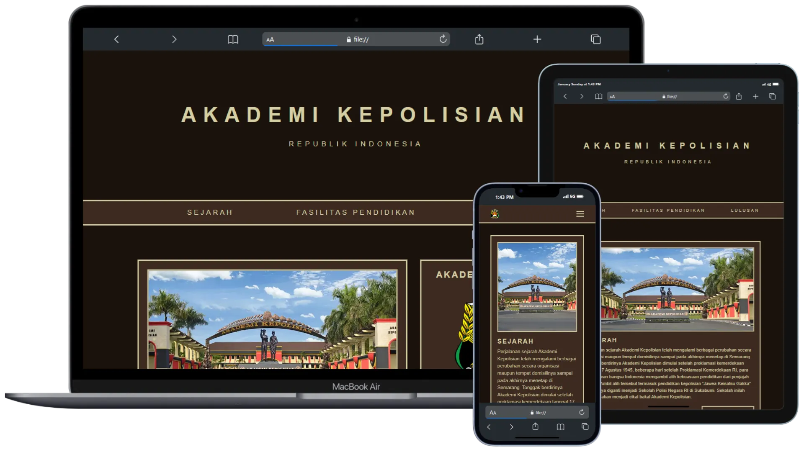

# AKADEMI KEPOLISIAN WEB PROFILE

I created a simple web profile for the <strong>Indonesian Police Academy</strong>, designed with a responsive interface to ensure accessibility on different devices such as mobile phones, tablets and laptops. This web profile highlights the <strong>Indonesian Police Academy</strong> and was developed as my final project in the <strong>Belajar Dasar Pemrograman Web</strong> course at <strong><a href="https://www.dicoding.com/" target="_blank">Dicoding Indonesia</a></strong>.

<section align="center">
   <figure>
      
      <figcaption>Responsive prototype of the Indonesian Police Academy web profile.</figcaption>
   </figure>
</section>

## Features

<section>
   <ul>
      <li><strong>Responsive:</strong> Flexible design ensures an optimal user experience across different screen sizes.</li>
      <li><strong>Elegant Design:</strong> Utilizes a professional <a href="https://colorhunt.co/palette/1a120b3c2a21d5cea3e5e5cb" target="_blank">color palette</a> to reflect the official identity of the Police Academy.</li>
      <li><strong>Structured Information:</strong> Provides information about history, facilities, and alumni.</li>
   </ul>
</section>

## Technologies Used

<section>
   <ul>
      <li>HTML5</li>
      <li>CSS3</li>
      <li>JavaScript</li>
   </ul>
</section>

## How to Run

<ol>
  <li>Clone the repository:
      <pre>
         <code>git clone https://github.com/hardidarmawan/akademi-kepolisian-web-profile.git</code>
      </pre>
  </li>
  <li>Open the <code>index.html</code> file in a browser to view the result.</li>
</ol>
